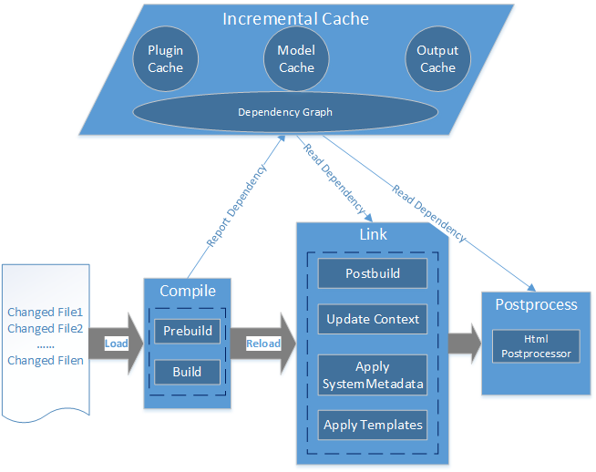

Introduction to *DocFX Incremental Build*
================================================
[Ministére](http://www.environnement.gouv.qc.ca/)

Workflow for DocFX build with incremental.



DocFX's build workflow is divided into three phases, namely `Compile`, `Link` and `PostProcess`.

By default, changed files would be collected by comparing file's `LastWriteTimeUtc` and `MD5`. We also provide the command option `--changesFile` to overwrite the default behavior. About the style of the changesFile, please refer to [ChangesFile](#changes-file) section.

Before `Compile` phase, only **changed files and their dependencies** would be loaded. During `Compile` phase, rebuilt articles could report new dependencies. After `Compile` phase, newly introduced dependencies would lead to some unchanged files being reloaded.

*DocFX Incremental Build Framework* provides [a flexible way](customize_a_processor_to_support_incremental.md) to define plugins/processors to support incremental build. Plugins that support incremental are free to [report dependencies](advanced_report_dependency.md) at `Compile` phase.

> [!Note]
> Only `Compile` phase could report/collect dependencies.

Framework also allows plugins to save/load context related info in Plugin Cache. For more details please refer to [Plugin cache](customize_a_processor_to_support_incremental.md#step3-optionalimplement--interface-for-plugins-that-need-to-access-context-info).

By default, incremental cache files will be put at path `obj/.cache/build/` relative to your `docfx.json`. You're also free to specify the path with option `--intermediateFolder`. About the structure of the cache folder please refer to [Cache file structure](advanced_cache_file_structure.md).


*Incremental Condition*
------------------------
Build could run incrementally only if all of the following conditions meet.

1. The version supports incremental.

Each version of file mappings would be built independently. For one version:

- Cache files are not corrupted.
- `DocFX` version isn't changed.
- Plugins' hash isn't changed.
- Templates' hash isn't changed.
- The `docfx.json` config hash isn't changed.
- This isn't a force build. Namely, no `--force` option.
- This isn't a debug run. Namely, no `--exportRawModel` or `--exportViewModel` option.
- If provided with [changesFile](#changes-file), this build's `CommitFromSHA` should be same with last build's `CommitToSHA`.


> [!Note]
> Not all configs in `docfx.json` are counted in when calculating the config hash. The below table lists configs that are ignored.
>
> Property              | Description
> --------------------- | ------------------------------------------------------------------------
> Files                 | the file collection that is included in docfx.json, namely `files`
> OutputBaseDir         | the base directory of output, namely `dest`
> ChangesFile           | the changes file
> MaxParallelism        | max parallelism
> VersionName           | version name
> ForceRebuild          | whether to force rebuild
> ForcePostProcess      | whether to force post processor
> LruSize               | lru size

2. The processor supports incremental.

- The processor implements the interface @Microsoft.DocAsCode.Plugins.ISupportIncrementalDocumentProcessor. Right now, @Microsoft.DocAsCode.Build.ConceptualDocuments.ConceptualDocumentProcessor and @Microsoft.DocAsCode.Build.ManagedReference.ManagedReferenceDocumentProcessor supports the interface.
- The processor's `IncrementalContextHash` isn't changed.
- All plugins in the processor implement the interface @Microsoft.DocAsCode.Plugins.ISupportIncrementalBuildStep.

  If you'd like to customize your processor to support incremental, you can view more from [Walkthrough: Customize a processor to support incremental](customize_a_processor_to_support_incremental.md).

*Changes File*
---------------
You can specify the changes with the build option `--changesFile`. This would overwrite `DocFX`'s default behavior to calculate changes.

Below is a sample changesFile `changes.tsv`.

```
<from>	f2166a5a0db6db595d263fb6c7288d64e535c4b2
<to>	158f883df18be9404df03f4844dd705251b280a2
F:/docfx-seed-master/docfx-seed-master/articles/csharp_coding_standards.md            Updated
F:/docfx-seed-master/docfx-seed-master/articles/images/seed.jpg      Created
F:/docfx-seed-master/docfx-seed-master/articles/test.md       Deleted
```

or you can use relative path to `docfx.json`.

```
<from>	f2166a5a0db6db595d263fb6c7288d64e535c4b2
<to>	158f883df18be9404df03f4844dd705251b280a2
articles/csharp_coding_standards.md            Updated
articles/images/seed.jpg      Created
articles/test.md       Deleted
```

The first two lines denote that the changelist is compared between the commit `<from>` and the commit `<to>`. The two lines could be omitted if you don't want to check the commit match. Otherwise, `DocFX` would check whether the changesFile's `<from>` is same with last build's `<to>`.

You can specify the changesFile from option: `--changesFile "<path of changes.tsv relative to docfx.json>"`, or you can update `docfx.json` to add `"changesFile": "<path of changes.tsv relative to docfx.json>"`.

Check the incremental information
---------------

The information of incremental build and post processing is saved in `incremental_info` of `manifest.json`, which describes the incremental status and processors information. For example:
```json
	"incremental_info": [{
		"status": {
			"can_incremental": false,
			"details": "Cannot build incrementally because config changed.",
			"incrementalPhase": "build"
		},
		"processors": {
			"TocDocumentProcessor": {
				"can_incremental": false,
				"details": "Processor TocDocumentProcessor cannot support incremental build because the processor doesn't implement ISupportIncrementalDocumentProcessor interface.",
				"incrementalPhase": "build"
			},
			"ManagedReferenceDocumentProcessor": {
				"can_incremental": false,
				"incrementalPhase": "build"
			}
		}
	},
	{
		"status": {
			"can_incremental": false,
			"details": "Cannot support incremental post processing, the reason is: last post processor info is null.",
			"incrementalPhase": "postProcessing"
		},
		"processors": {}
	}]
```
